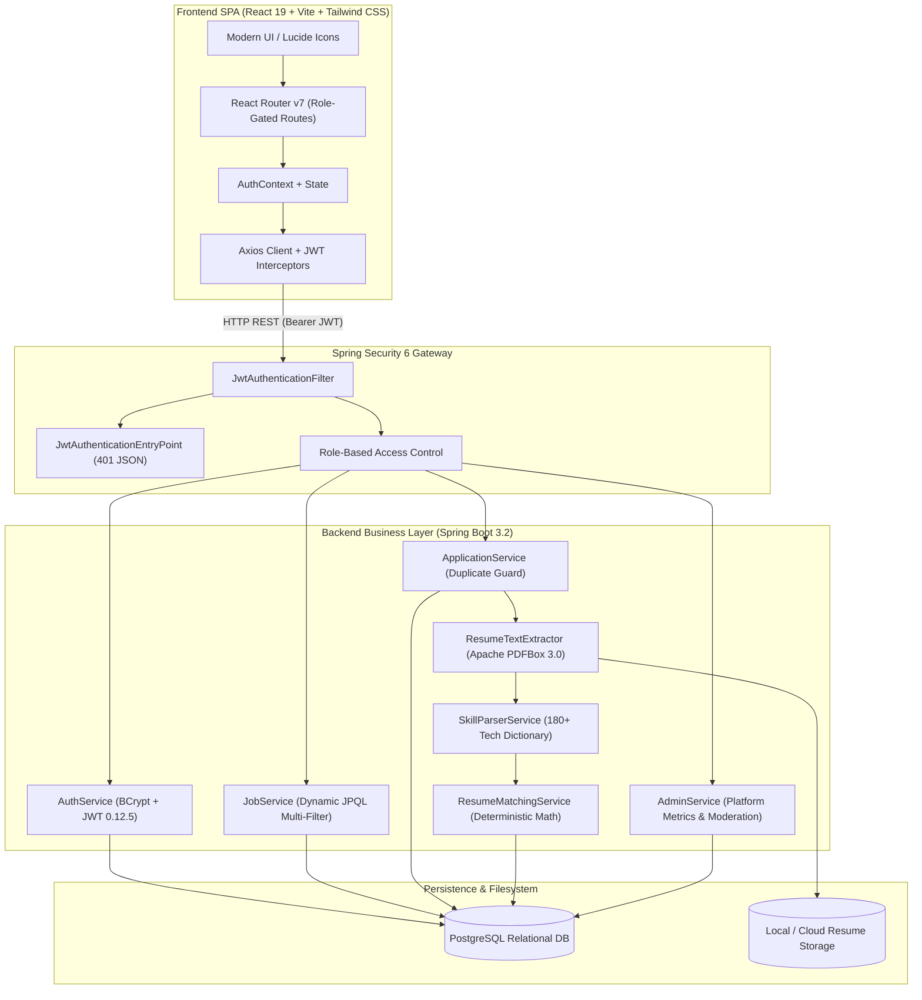

# 🎯 Job Portal + Deterministic Resume Analyzer

> A production-style, full-stack enterprise recruitment portal featuring dynamic multi-criteria job matching and a deterministic resume-to-job skill analysis engine built with **Spring Boot 3.2**, **PostgreSQL**, and **React 19 + Vite + Tailwind CSS**.

---

## 🏛️ System Architecture



---

## ⚡ Tech Stack

| Layer | Technologies |
| :--- | :--- |
| **Backend** | Java 17, Spring Boot 3.2.4, Spring Security 6, Spring Data JPA, Hibernate, JJWT 0.12.5, Apache PDFBox 3.0.1, Apache POI 5.2.5, Lombok |
| **Database** | PostgreSQL (Relational schema with foreign keys, indexes, and unique constraints) |
| **Frontend** | React 19, Vite, Tailwind CSS v4, React Router DOM v7, Axios, Lucide React, React Hot Toast |
| **Authentication** | Stateless JWT (HMAC-SHA256), BCrypt password hashing, Granular RBAC (`ROLE_JOB_SEEKER`, `ROLE_RECRUITER`, `ROLE_ADMIN`) |

---

## 🔑 Default Credentials (Auto-Seeded)

The application automatically seeds realistic demo data on initial startup:

| Role | Email | Password | Details |
| :--- | :--- | :--- | :--- |
| **ADMIN** | `admin@jobportal.com` | `Admin@123` | Full dashboard metrics, user status toggles, job moderation |
| **RECRUITER** | `sarah.recruiter@techcorp.com` | `Recruiter@123` | Associated with *TechCorp Solutions*, manages jobs & applicants |
| **RECRUITER** | `alex.hiring@cloudscale.io` | `Recruiter@123` | Associated with *CloudScale Systems*, manages DevOps postings |
| **JOB_SEEKER** | `john.doe@gmail.com` | `Seeker@123` | Full-stack Java candidate with active resume & skills |
| **JOB_SEEKER** | `emily.chen@gmail.com` | `Seeker@123` | Backend Java & Kafka candidate with applications submitted |

---

## 🚀 Getting Started

### 1. Database Setup (PostgreSQL)
Ensure PostgreSQL is running locally on port `5432`:
```sql
CREATE DATABASE jobportal_db;
```

### 2. Backend Setup
Navigate to the `backend/` directory:
```bash
cd backend
```
*(Optional)* Configure database credentials in `.env` or `src/main/resources/application.yml`:
```properties
DB_URL=jdbc:postgresql://localhost:5432/jobportal_db
DB_USERNAME=postgres
DB_PASSWORD=postgres
JWT_SECRET=your_base64_encoded_256_bit_jwt_secret_key_here
```
Run the Spring Boot application:
```bash
mvn spring-boot:run
```
The backend will initialize at `http://localhost:8080`.

### 3. Frontend Setup
Navigate to the `frontend/` directory in a new terminal:
```bash
cd frontend
npm install
npm run dev
```
Open `http://localhost:5173` in your browser.

---

## 📡 REST API Documentation

### Authentication (`/api/auth`)
| Method | Endpoint | Access | Description |
| :--- | :--- | :--- | :--- |
| `POST` | `/api/auth/register` | Public | Register new Job Seeker or Recruiter |
| `POST` | `/api/auth/login` | Public | Authenticate and retrieve JWT token |
| `GET` | `/api/auth/me` | Authenticated | Retrieve authenticated user profile |

### Job Management (`/api/jobs`)
| Method | Endpoint | Access | Description |
| :--- | :--- | :--- | :--- |
| `GET` | `/api/jobs` | Public | Search, filter (keyword, location, skills, type, experience) with pagination |
| `GET` | `/api/jobs/{id}` | Public | Detailed job posting with real-time candidate match score |
| `POST` | `/api/jobs` | Recruiter, Admin | Post a new job opportunity |
| `PUT` | `/api/jobs/{id}` | Recruiter, Admin | Update existing job posting |
| `DELETE` | `/api/jobs/{id}` | Recruiter, Admin | Delete job posting |
| `GET` | `/api/jobs/recruiter/my-jobs` | Recruiter, Admin | View jobs posted by logged-in recruiter |
| `PATCH` | `/api/jobs/{id}/toggle-status`| Recruiter, Admin | Toggle job status between `ACTIVE` and `CLOSED` |

### Applications (`/api/applications`)
| Method | Endpoint | Access | Description |
| :--- | :--- | :--- | :--- |
| `POST` | `/api/applications` | Job Seeker | Submit job application (enforces duplicate prevention) |
| `GET` | `/api/applications/seeker/my-applications` | Job Seeker | Candidate application history and status tracker |
| `GET` | `/api/applications/job/{jobId}` | Recruiter, Admin | Review applicants for a specific job posting |
| `GET` | `/api/applications/recruiter/all` | Recruiter, Admin | Review all candidates across all posted jobs |
| `PATCH` | `/api/applications/{id}/status` | Recruiter, Admin | Update candidate status (`APPLIED`, `SHORTLISTED`, `REJECTED`, `HIRED`) |
| `GET` | `/api/applications/{id}` | Owner, Recruiter | View individual application and cover letter |

### Resume Analyzer & Storage (`/api/resumes`)
| Method | Endpoint | Access | Description |
| :--- | :--- | :--- | :--- |
| `POST` | `/api/resumes/upload` | Job Seeker | Upload PDF/DOCX/TXT resume, extract text, and parse skills |
| `GET` | `/api/resumes/my-resumes` | Job Seeker | Candidate resume repository |
| `GET` | `/api/resumes/{id}` | Owner, Recruiter | View parsed resume metadata and preview |
| `GET` | `/api/resumes/download/{id}` | Owner, Recruiter | Secure binary resume file download |
| `POST` | `/api/resumes/match` | Public/Auth | Calculate deterministic match score between resume and job |
| `GET` | `/api/resumes/skills/supported` | Public | View the 180+ technology skill dictionary |

### Admin Moderation (`/api/admin`)
| Method | Endpoint | Access | Description |
| :--- | :--- | :--- | :--- |
| `GET` | `/api/admin/stats` | Admin | Aggregate system metrics & application status breakdown |
| `GET` | `/api/admin/users` | Admin | Paginated user management directory |
| `PATCH` | `/api/admin/users/{id}/toggle-status` | Admin | Enable/disable user account access |
| `DELETE` | `/api/admin/users/{id}` | Admin | Remove user from platform |
| `DELETE` | `/api/admin/jobs/{id}` | Admin | Delete inappropriate job posting |
